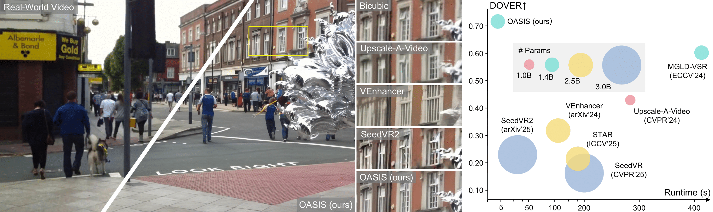
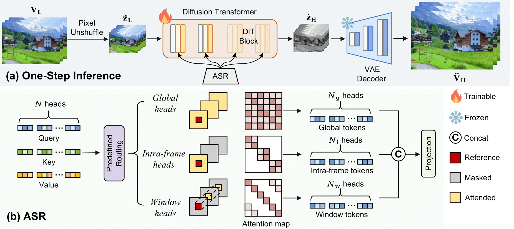
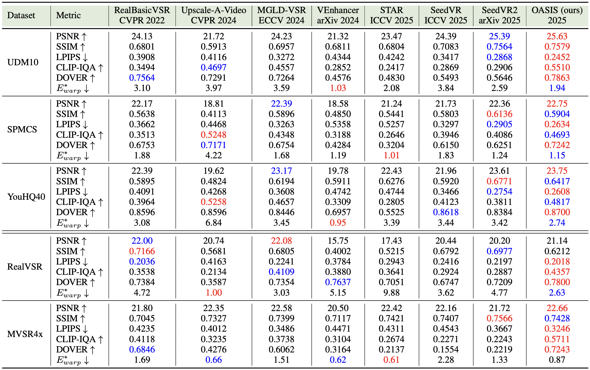
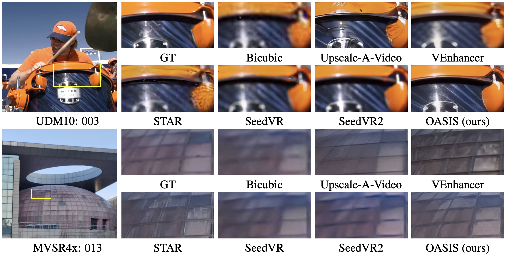
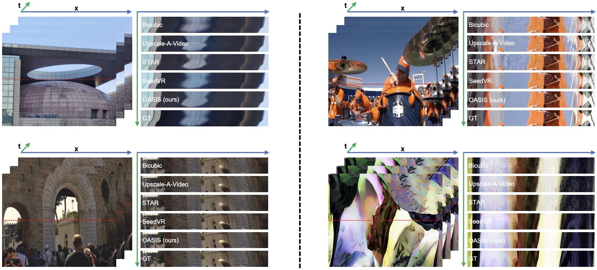

# Towards Redundancy Reduction in Diffusion Models for Efficient Video Super-Resolution

[Jinpei Guo](https://jp-guo.github.io/), [Yifei Ji](https://github.com/Niax23/), [Zheng Chen](https://zhengchen1999.github.io/), [Yufei Wang](https://wyf0912.github.io/), [Sizhuo Ma](https://sizhuoma.netlify.app/), [Yong Guo](https://www.guoyongcs.com/), [Yulun Zhang](http://yulunzhang.com/), and [Jian Wang](https://jianwang-cmu.github.io/), "Towards Redundancy Reduction in Diffusion Models for Efficient Video Super-Resolution", arXiv, 2025

[[project page]](https://jp-guo.github.io/oasis.github.io/) [[paper](https://arxiv.org/abs/2509.23980)] [[supplementary material](https://github.com/jp-guo/OASIS/releases/tag/v1)]

#### 🔥🔥🔥 News

- **2025-09-30:** This repo is released.

---

> **Abstract:** Diffusion models have recently shown promising results for video super-resolution (VSR).
              However, directly adapting generative diffusion models to VSR can result in redundancy,
              since low-quality videos already preserve substantial content information.
              Such redundancy leads to increased computational overhead and learning burden,
              as the model performs superfluous operations and must learn to filter out irrelevant information.
              To address this problem, we propose OASIS, an efficient an efficient <b>o</b>ne-step diffusion model with
              <b>a</b>ttention <b>s</b>pecialization for real-world v<b>i</b>deo <b>s</b>uper-resolution.
              OASIS incorporates an attention specialization routing that assigns
              attention heads to different patterns according to their intrinsic behaviors. This routing mitigates
              redundancy while effectively preserving pretrained knowledge, allowing diffusion models to better adapt
              to VSR and achieve stronger performance. Moreover, we propose a simple yet effective progressive training
              strategy, which starts with temporally consistent degradations and then shifts to inconsistent settings.
              This strategy facilitates learning under complex degradations. Extensive experiments demonstrate that
              OASIS achieves state-of-the-art performance on both synthetic and real-world datasets. OASIS also
              provides superior inference speed, offering a <b>6.2&times;</b> speedup over one-step diffusion
              baselines such as SeedVR2.



## ⚒️ TODO

* [ ] Release code and pretrained models

## 🔎 Method Overview


## <a name="results"></a>🔎 Results

<details>
<summary>&ensp;Quantitative Comparisons (click to expand) </summary>
<li> Quantitative results on Kodak dataset. 
<p align="center">

</p>
</li>
</details>
<details open>
<summary>&ensp;Visual Comparisons (click to expand) </summary>
<p align="center">

</p>
<p align="center">

</p>
</details>

✨ **For more visual results, visit our [project page](https://jp-guo.github.io/oasis.github.io/)!** ✨


## <a name="citation"></a>📎 Citation

If you find the code helpful in your research or work, please cite our work.

```
@article{guo2025towards,
    title={Towards Redundancy Reduction in Diffusion Models for Efficient Video Super-Resolution},
    author={Guo, Jinpei and Ji, Yifei and Chen, Zheng and Wang, Yufei and Ma, Sizhuo and Guo, Yong and Zhang, Yulun and Wang, Jian},
    journal={arXiv preprint arXiv:2509.23980},
    year={2025}
}
```